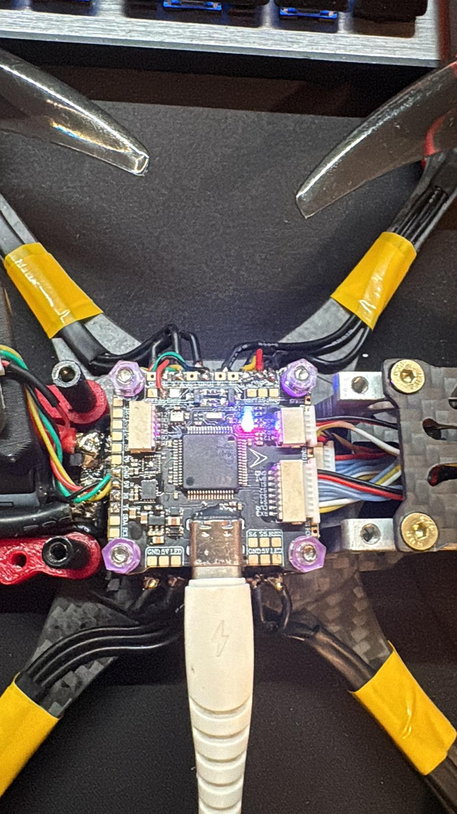

# Comprehensive Build Guide: Budget 5" 6S Freestyle FPV Quad

## Introduction

This repository documents the complete lifecycle of a budget-friendly, high-performance 5-inch 6S FPV drone. This machine leverages a robust analog video system, low-latency ExpressLRS control, and efficient 1750KV motors to deliver a versatile freestyle platform.

This guide provides a logical, validated assembly sequence, safety procedures, and hardware interconnect documentation for reproducing this build. It is designed to be used in conjunction with the main [README.md](README.md).

---

## 1. Validated Interconnect Matrix (Wiring Reference)

This table overrides generic product documentation—it is physically validated against the soldered board from this build. Use this matrix for all solder operations.

| Source Component | Wire Color / Function | FC Pad Label | Pad Physical Location | Signal Type / Notes |
| :--- | :--- | :--- | :--- | :--- |
| **CADDXFPV Camera**| White (`VIDEO`) | **CAM** | Left Rail | Raw video input to OSD |
| | Red (`+5V`) | **5V** | Left Rail | Power Input (BEC) |
| | Black (`GND`) | **GND** | Left Rail | Power Ground |
| **5.8G VTX** | Green (`Data`) | **T1** | **Top Left Corner (VALIDATED)** | SmartAudio/IRC Control (UART1 TX) |
| | Yellow (`VIDEO`) | **VTX** | Left Rail | OSD Video Output |
| | Red (`BAT`) | **9V** | Left Rail | Filtered Power (9V BEC) |
| | Black (`GND`) | **GND** | Left Rail | Power Ground |
| **ELRS Nano RX** | Green (`RX Data`) | **T2** | Bottom Rail | CRSF Serial Data (UART2 TX) |
| | Yellow (`TX Data`) | **R2** | Bottom Rail | CRSF Serial Data (UART2 RX) |
| | Red (`+5V`) | **5V** | Bottom Rail | Receiver Power (BEC) |
| | Black (`GND`) | **GND** | Bottom Rail | Power Ground |
| **4-in-1 ESC** | 8-Pin Harness | **ESC Plug**| Top Edge | M1-M4, BAT+, GND, Telemetry, Curr |

---

## 2. Safety Best Practices

FPV assembly involves high-current electricity, sensitive electronics, and exposed soldering. Follow these strict safety protocols.

*   **Multimeter Verification:** **Never** connect a high-voltage LiPo (3S-6S) without checking for a direct short. Check continuity between **VBAT (+)** and **GND (-)** pads on the main ESC input.
*   **Smoke Stopper:** **Always** use a dedicated Smoke Stopper (current limiter) for the initial 3–4 bench power-up tests.
*   **Antenna Rule:** **Never** power up the Video Transmitter (VTX) without its 5.8GHz antenna attached. Running a VTX un-terminated will cause total thermal failure in seconds.
*   **Props Off:** **Never** have propellers installed on the motors when connecting a battery on the workbench. Propellers are **strictly** for field installation.

---

## 3. Recommended Build Sequence

For the cleanest final assembly and efficient troubleshooting, adhere to this specific order of operations:

### Phase 1: Frame Prep & Mechanical Assembly

1.  **Threadlocker:** Secure carbon arms to the MARK5 mid-plate using screws pre-treated with blue threadlocker (Loctite 242).
2.  **TPU Installation:** Mount red TPU arm guards and the rear tail antenna mount before assembling the mid-plate.
3.  **Motor Mount:** Mount the 2306 1750KV motors and route the phase wires along the arms, securing them from potential propeller strikes.

### Phase 2: ESC & VBAT Filtering

1.  **Main Leads:** Tin and solder the heavy-gauge XT60 power leads (Red VBAT+, Black GND-) to the ESC input pads.
2.  **Capacitor Solder:** **Must solder** the 35V 1000uF Low-ESR capacitor **directly** across the ESC VBAT+ and GND- pads. The stripe on the capacitor indicates the negative side.
3.  **Continuity Check:** Check with a multimeter to verify **NO continuity** between VBAT+ and GND-.

### Phase 3: Stack & Component Wiring

1.  **FC Orientation:** Install the rubber damping grommets into the F405 flight controller. Verify the orientation arrow on the board points forward (or reconfigure the board yaw in Betaflight later).
2.  **Component Solder:** Solder the FPV Camera, VTX, and ELRS Receiver according to the [validated interconnect matrix](#1-validated-interconnect-matrix-wiring-reference) in Section 1.

### Phase 4: Validated Receiver Prep

1.  **Prep Wire Harness:** Tin the four pads (`5V`, `GND`, `TX`, `RX`) on the SpeedyBee Nano RX.
2.  **Insulation:** Pre-tin silicone leads, solder them, and seal the receiver PCB using transparent heat-shrink tubing to prevent shorts against the carbon frame.

### Phase 5: Pre-Flight Safety Configuration

1.  **Bench Power Test:** Connect via USB to verify FC power. Connect via Smoke Stopper + 6S LiPo to ensure the ESC tines and VTX initiates successfully.
2.  **Betaflight Config:** Configure Ports (UART1 for SmartAudio, UART2 for Serial Rx), set Receiver Provider to `CRSF`, and verify motor direction before 

### Phase 6: Finalizing & Top-Plate Assembly

1. **Clean Cable Management:** Before closing the frame, use small zip ties or heat shrink to secure all receiver, camera, and VTX wiring harnesses neatly to the stack's standoffs. Ensure no loose wires can touch the carbon frame or vibrate into the ESC's MOSFETs.
2. **Top-Plate Install:** Once the wiring is verified and secure, install the MARK5 top plate using threadlocker on all frame screws. Tighten the standoffs firmly to ensure mechanical rigidity.

### Phase 7: Validated Pre-Flight Checklist

With the build functionally complete, the final safety checks must be performed. Do **NOT** install propellers yet.

1. **Physical Integrity:** Check every frame screw again for blue threadlocker residue and proper tightness. Verify motor mounts are secure.
2. **Failsafe Check:** Connect the quad to Betaflight. Ensure props are OFF. Turn on your transmitter. Go to the Betaflight "Receiver" tab. Verify your transmitter inputs (throttle, roll, etc.) match the bars. Now, **turn off your transmitter.** Verify the throttle bar drops to 0 and the armor switch disarms automatically.
3. **VTX Check:** Attach antennas. Apply power via smoke stopper. Verify that you have a clear, interference-free video feed in your goggles on the expected channel. Ensure the camera angle is adjustable.
4. **Motor Direction (Props OFF):** Under the Betaflight "Motors" tab, use a single 1S-compatible battery or smoke stopper to gently spin Motor 1. Verify it spins the correct direction for your configuration (e.g., Prop-Out). Repeat for Motors 2, 3, and 4. Use the ESC configuration tool (e.g., BLHeliSuite32) if any motor direction needs to be reversed.

### Phase 8: Maiden Flight Ready

The documentation phase is complete; the quad is now physically and functionally validated for flight.

*   **Battery Mounting:** Place the 6S LiPo battery on the top plate. Use the provided high-quality battery strap and/or adhesive silicone battery pad to secure the battery firmly. Ensure it cannot shift and that the power lead can connect neatly.
*   **Final VTX and RX Antenna Mount:** Re-check that the SMA bulkhead connector is fully tightened on the TPU tail mount and that the video antenna is secure. Ensure your diversity ELRS receiver antennas are positioned according to best practices (e.g., T-antenna layout) and clear of potential carbon frame shielding.
*   **Propellers On:** **Only at the flying field:** Install props, verify correct direction, and ensure lock nuts are tight. Your custom budget 5" build is flight-ready.installing top plate.
