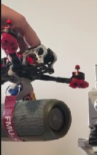
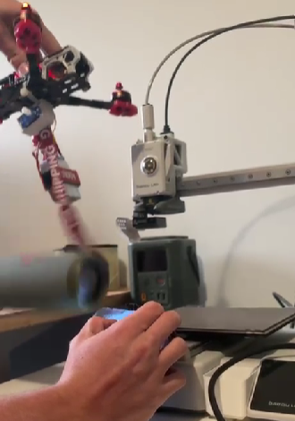

# Payload Release System

This directory contains the documentation, image references, and video demonstration for the servo-driven payload release mechanism.

## Mechanism States & Demonstration
<video src="Payload_Media/Payload.mp4" controls="controls" width="100%"></video>

| Drop Mechanism (Loaded) | Drop Mechanism (Released) |
| :---: | :---: |
|  |  |

## 1. System Overview
The mechanical payload release is actuated by a standard 5V PWM micro-servo. It is driven directly by the flight controller and mapped to an auxiliary switch on the 2.4GHz ELRS radio transmitter for pilot-controlled deployment.

## 2. Hardware Integration
The servo requires a PWM signal pad. Because standard F405 flight controllers often lack dedicated servo pads, we repurpose the `LED` pad using Betaflight's resource remapping.

| Servo Wire | Flight Controller Pad | Function |
| :--- | :--- | :--- |
| **Signal** (Yellow/Orange) | **LED** (or spare motor pad) | PWM Control Signal |
| **VCC** (Red) | **5V** | 5V BEC Power |
| **GND** (Brown/Black) | **GND** | Ground |

*⚠️ **Safety Note:** Verify the flight controller's 5V BEC amperage rating. A stalled servo can draw excess current and cause a flight controller brownout.*

## 3. Betaflight Configuration (CLI Remapping)
To route a PWM signal to the servo via the LED pad, remap the hardware resources in the Betaflight CLI.

**Step 1: Identify the target pin.**
Type `resource` in the CLI and locate the pin assigned to the LED strip.
```text
# Example output:
resource LED_STRIP 1 A00
